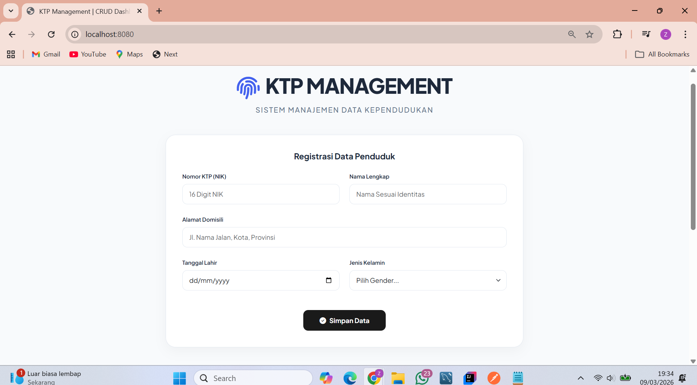
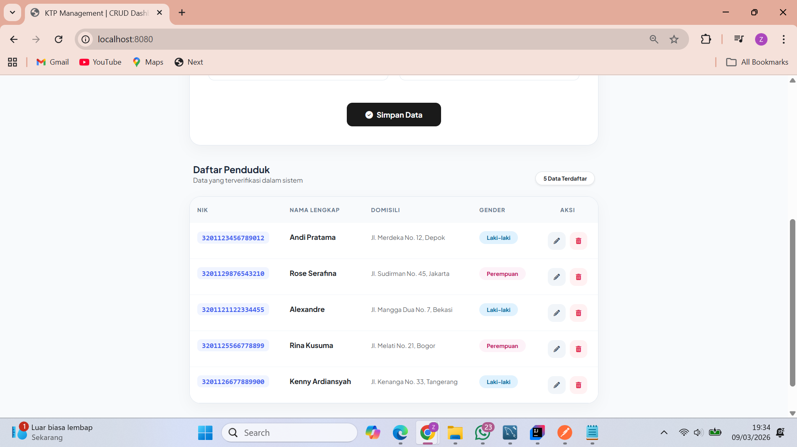
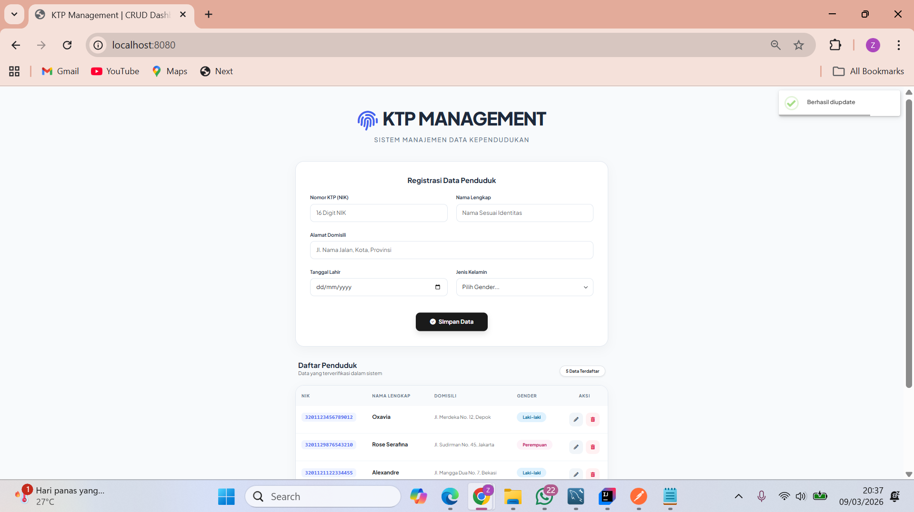
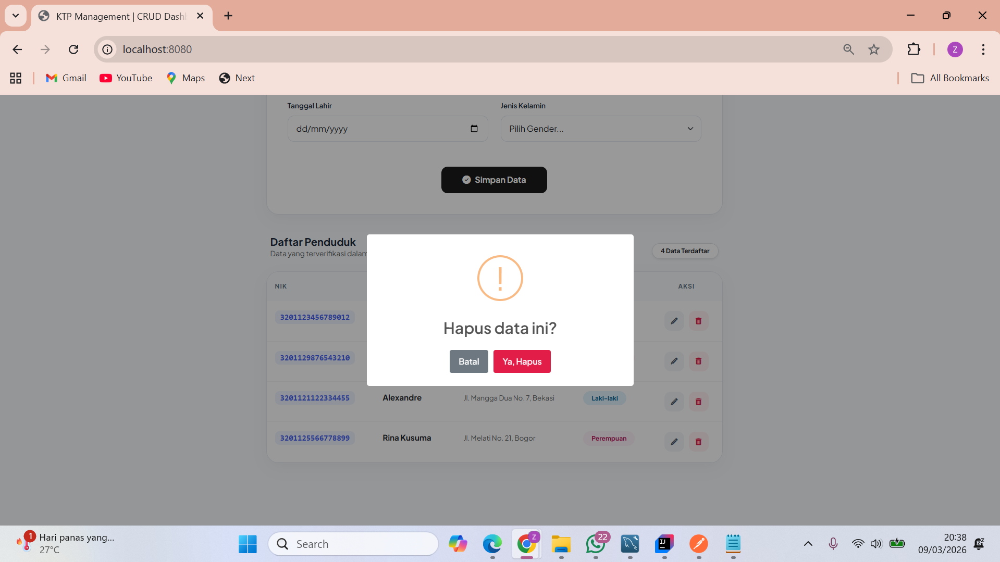
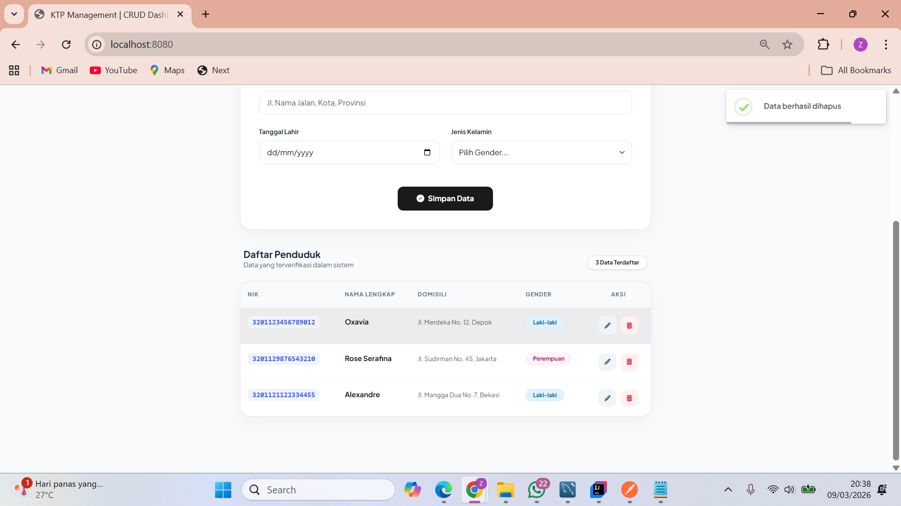
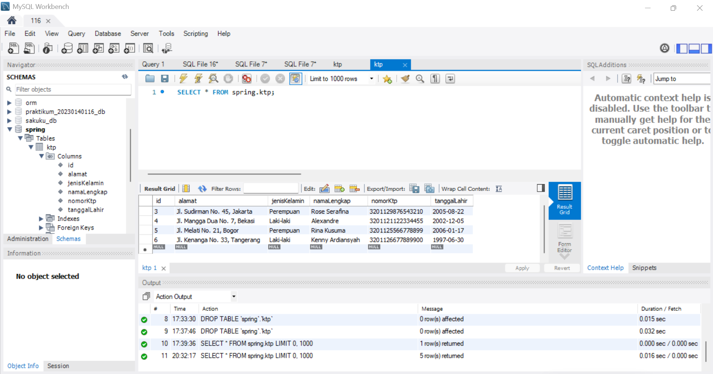
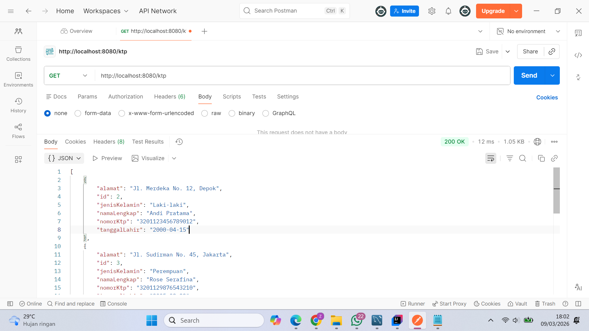
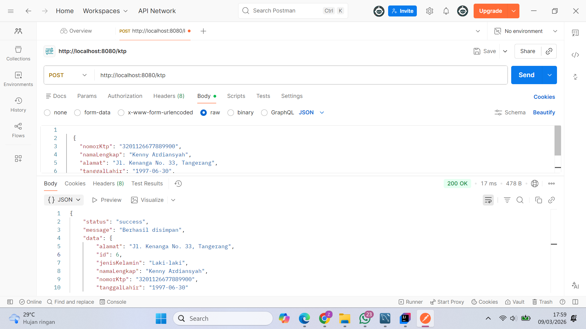
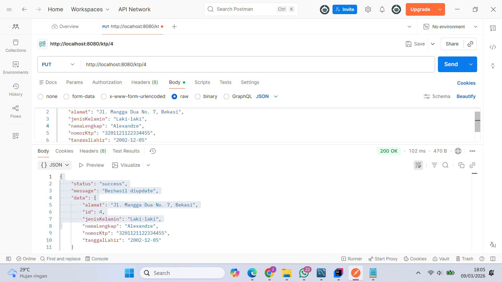
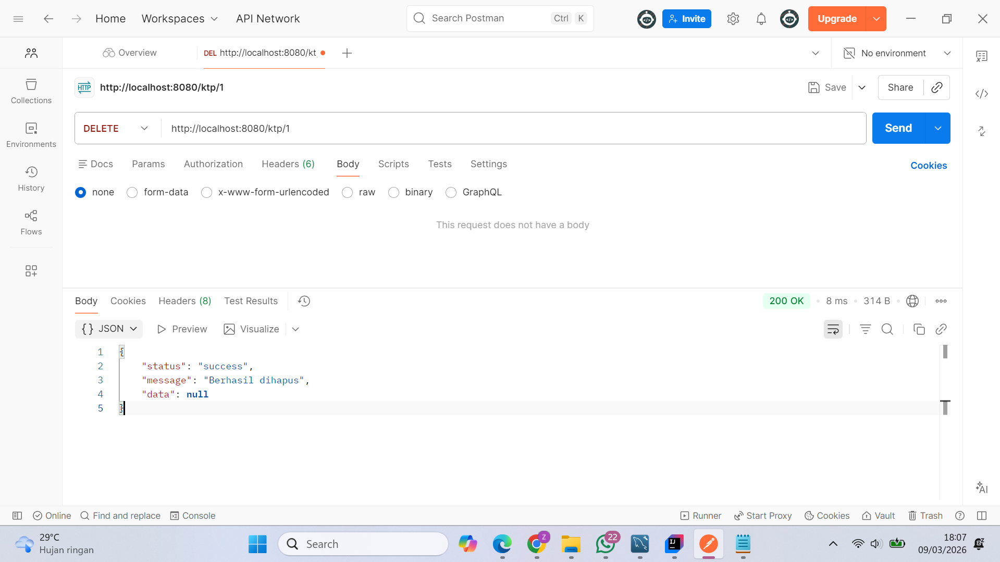

# Tugas CRUD KTP - Spring Boot & JQuery Ajax

Aplikasi manajemen data KTP berbasis web yang mengintegrasikan framework **Spring Boot** sebagai Server-side API dan **JQuery Ajax** sebagai Client-side interaksi.

---

## Struktur Package
```text
src/main/java/com/example/praktikum2/
├── controller/
│   └── KtpController.java
├── dto/
│   └── KtpDto.java
├── model/
│   └── KtpEntity.java
├── mapper/
│   └── KtpMapper.java
├── repository/
│   └── KtpRepository.java
├── service/
│   ├── KtpService.java
│   └── impl/
│       └── KtpServiceImpl.java
├── util/
│   └── WebResponse.java
└── Praktikum2Application.java

src/main/resources/
├── static/
│   └── index.html
└── application.properties
```
---

## Dokumentasi REST API

### 1. Tambah Data KTP
*   **Method** : `POST`
*   **URL** : `/ktp`
*   **Request Body** :
```json
{
  "nomorKtp": "3201126677889900",
  "namaLengkap": "Kenny Ardiansyah",
  "alamat": "Jl. Kenanga No. 33, Tangerang",
  "tanggalLahir": "1997-06-30",
  "jenisKelamin": "Laki-laki"
}
```
*   **Respon Sukses** :
```json
    {
    "status": "success",
    "message": "Berhasil disimpan",
    "data": {
    "id": 6,
    "nomorKtp": "3201126677889900",
    "namaLengkap": "Kenny Ardiansyah",
    "alamat": "Jl. Kenanga No. 33, Tangerang",
    "tanggalLahir": "1997-06-30",
    "jenisKelamin": "Laki-laki"
    }
    }
```

### 2. Ambil Semua Data KTP
* **Method** : `GET`
* **URL** : `/ktp`
* **Respon** : `List<KtpDto>` dalam format JSON.

### 3. Ambil Data Berdasarkan ID
* **Method** : `GET`
* **URL** : `/ktp/{id}`
* **Contoh** : `http://localhost:8080/ktp/4`

### 4. Perbarui Data KTP
* **Method** : `PUT`
* **URL** : `/ktp/{id}`
* **Respon Sukses** :

````   JSON
   {
   "status": "success",
   "message": "Berhasil diupdate",
   "data": {
   "id": 4,
   "namaLengkap": "Kenny Update",
   "nomorKtp": "3201126677889900",
   ...
   }
   }
   ````
### 5. Hapus Data KTP
* **Method** : `DELETE`
* **URL**  : `/ktp/{id}`
* **Respon Sukses** :

```JSON
   {
   "status": "success",
   "message": "Berhasil dihapus",
   "data": null
   }
```

## Penanganan Error (Error Handling)
Aplikasi ini dilengkapi dengan validasi data untuk menjaga integritas database:
* **Unique Constraint** : Jika nomorKtp yang diinput sudah terdaftar di database.
* **Data Not Found**: Jika melakukan akses/update/delete pada ID yang tidak ada.

**Contoh Respon Error (Duplikat NIK)**:
````
JSON
{
"status": "error",
"message": "Nomor KTP sudah terdaftar!",
"data": null
}
````
---
## Screenshot Tampilan
**1. Tampilan Website (Frontend)**
   
    
#### berhasil update
 
#### berhasil delete



**2. Struktur Database (MySQL)**

   
**3. Pengetesan di Postman**
* GET

* POST

* UPDATE

* DELETE

